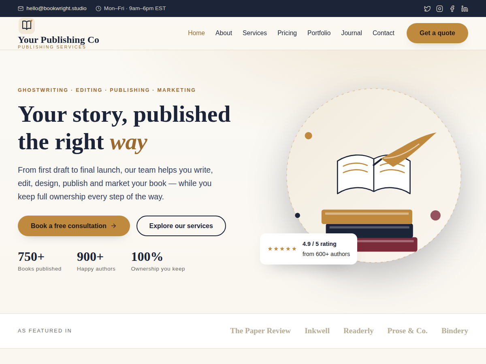

# Bookwright — WordPress Theme for Book Publishing Services

Bookwright is a complete, ready-to-use WordPress theme for a **book publishing
services company** (ghostwriting, editing, design, publishing, printing,
marketing, author websites and media booking). Activate it and you get a full
website immediately — homepage, services, pricing, a portfolio showcase, a
book-a-free-consultation flow, a blog and a contact page — all pre-filled with
professional demo content, illustrations and a logo.



---

## Everything is editable — no code

Every section is managed from the WordPress dashboard:

| Section | Where to edit |
|---|---|
| Services (home + Services page) | **Services** menu (custom post type — icon, description, link) |
| Testimonials | **Testimonials** menu (quote, author, role, rating, photo) |
| Team members (About page) | **Team** menu (name, role, photo, bio) |
| Pricing plans | **Pricing Plans** menu (price, period, features, “most popular” flag) |
| FAQs | **FAQs** menu (question = title, answer = content) |
| Portfolio projects | **Portfolio** menu (showcase — no store/pricing) |
| Blog posts | **Posts** |
| Homepage headings, stats, process steps, “featured in” logos | **Appearance → Customize → “Bookwright · Homepage Sections”** |
| Hero, contact details, social links, footer text, logo | **Appearance → Customize** |

Templates fall back to sensible defaults if you delete everything, so the site never breaks.

## What you get out of the box

- **One-click demo content.** On activation the theme automatically creates
  every page, a navigation menu, sample blog posts and a sample portfolio,
  and sets the homepage — no importer plugin required.
- **Designed homepage** (`front-page.php`) with hero, services, process,
  a portfolio strip, a book-a-call band, stats, testimonials, journal and CTA.
- **Portfolio showcase** — a `Portfolio` post type (client, service provided,
  category, cover) to display books you’ve helped create. No storefront.
- **Page templates**: About, Services, Pricing (with FAQ), Portfolio and
  Contact (with a styled form + map).
- **Blog** with sidebar, single post, categories, tags, search and comments.
- **Bundled artwork** — logo, hero illustration, book covers, avatars and
  service graphics, all crisp SVG (no external image dependencies).
- **Customizer options** for contact details, social links, footer text and
  the homepage hero copy.
- Responsive, accessible (skip link, ARIA, keyboard nav), translation-ready
  (`bookwright` text domain) and built on clean HTML5.

---

## Installation

### Option A — Upload the zip (recommended)

1. In WordPress go to **Appearance → Themes → Add New → Upload Theme**.
2. Choose `bookwright.zip` and click **Install Now**.
3. Click **Activate**.
4. Done — visit your site. The homepage, menu, pages and sample portfolio are
   already there.

### Option B — Manual

1. Copy the `bookwright` folder into `wp-content/themes/`.
2. Go to **Appearance → Themes** and activate **Bookwright**.

> The demo content runs once, the first time the theme is activated. Deleting a
> demo page or book will not bring it back on re-activation (a flag prevents
> duplicates). To force a re-import, delete the `bookwright_demo_imported`
> option from **Tools → (any options plugin)** or the database.

---

## First steps after activating

1. **Appearance → Customize → Bookwright · Contact & Social** — set your real
   email, phone, address, hours and social URLs.
2. **Appearance → Customize → Site Identity** — upload your own logo (optional;
   a default logo is included).
3. **Appearance → Customize → Bookwright · Homepage Hero** — tweak the hero
   headline and buttons.
4. **Contact form** — install a form plugin (Contact Form 7 or WPForms) and
   paste its shortcode into the **Contact** page. The theme detects the
   shortcode and renders your real form; otherwise a styled demo form is shown.
5. **Portfolio** — edit the sample projects under **Portfolio**, or add your own.
   Set a featured image to use a real cover, or the bundled placeholder is used.

---

## Structure

```
bookwright/
├── style.css                Theme header + baseline styles
├── functions.php            Setup, assets, widgets, includes
├── front-page.php           Designed homepage
├── header.php / footer.php  Site chrome
├── index / single / page / archive / search / 404 / comments / sidebar
├── single-book.php          Portfolio project detail page
├── archive-book.php         Portfolio archive (with category filters)
├── searchform.php
├── inc/
│   ├── template-tags.php     Icons, meta, breadcrumbs, helpers
│   ├── cpt-book.php          "Portfolio" post type + category taxonomy + meta box
│   ├── customizer.php        Contact / social / hero options
│   └── demo-content.php      One-click demo installer
├── page-templates/           About, Services, Pricing, Portfolio, Contact
├── template-parts/           book-card, cta
└── assets/
    ├── css/theme.css         Full design system
    ├── css/editor-style.css  Block editor styles
    ├── js/theme.js           Nav, counters, form feedback
    └── images/               Logo + SVG illustrations
```

## Requirements

- WordPress 6.0+
- PHP 7.4+

## License

GNU General Public License v2 or later.
